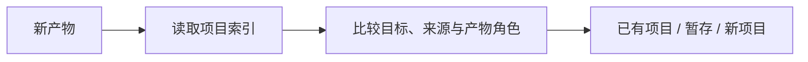

# Q1 S1 Contract Walkthrough

## Status

Deterministic walkthrough of the written S1 contract, not a blind model run. It checks whether the revised instructions can describe a complete Quick path before forward testing with a fresh Agent in S3.

## Input

“An existing note-organizing skill sometimes assigns generated projects to the wrong folder. Add one classification rule and help me understand the judgment behind it.”

Available context includes the project index, the existing classification skill, prior classification decisions, and a reversible Git worktree.

## Route

**Quick.** This is a reversible rule change in an already indexed project, prior context is available, and no safety, privacy, irreversibility, or high-cost blocker is present.

One-sentence user-facing rationale:

> 这是已有分类流程中的一处可逆规则修改，项目历史已经足够，我先用精简节奏推进；若测试暴露新的归属边界，再只放大那一段。

## Minimum Context Map

The change belongs at `B → C`: candidate names and keywords find possible projects, while goal, source, and artifact role decide identity.

## One Judgment Question

**What evidence determines project identity?**

The Agent may bundle these mechanics without stopping:

1. read the index and candidate project records;
2. inspect the generated artifact and its creation history;
3. edit the classification rule;
4. run positive and negative regression cases;
5. present the changed rule and evidence together.

Stop only if evidence introduces a new project-boundary choice, an operation would move or delete material data, or the results contradict the source/role model.

## Learner Evidence

The learner should see:

- a correct example where a generated article belongs to the skill project that produced it;
- an incorrect example where file extension or similar naming alone assigns it to a topic project;
- why both outcomes test the same goal/source/role rule.

This evidence supports the single stage-end question; it is not three separate quizzes.

## Contract Result

- Quick rationale: present.
- Reused background: present; no repeat questionnaire.
- Minimum relevant path: present.
- Mechanical stops: zero before a consequential decision or final stage check.
- User stage check: one integrated question.
- Result: **contract pass**.

## Limitation

This walkthrough proves instruction coherence only. It does not prove that a fresh Agent will follow the contract consistently; that requires forward testing in S3.
